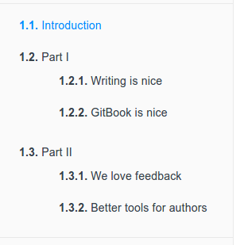
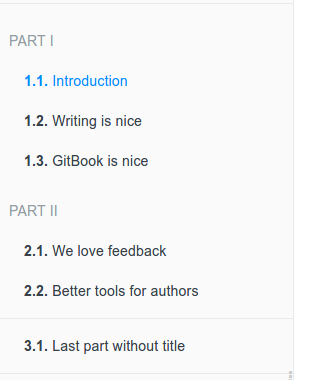

# 目录结构
GitBook 基本的目录结构如下所示
```
.
├── book.json
├── README.md
├── SUMMARY.md
├── chapter-1/
|   ├── README.md
|   └── something.md
└── chapter-2/
    ├── README.md
    └── something.md
```
这里主要讲下 GitBook 预定义的几个文件的作用
## book.json
存放配置信息，在下一章中所讲的配置信息都是在这个文件里定义的，关于该文件的配置可以看 [配置](settings.md) 这个章节。

## Summary
概要文件主要存放 GitBook 的文件目录信息，左侧的目录就是根据这个文件来生成的，默认对应的文件是 `SUMMARY.md`，可以在 `book.json` 重新定义该文件的对应值。它通过 Markdown 中的列表语法来表示文件的父子关系，下面是一个简单的示例：
```
# Summary
* [Introduction](README.md)
* [Part I](part1/README.md)
    * [Writing is nice](part1/writing.md)
    * [GitBook is nice](part1/gitbook.md)
* [Part II](part2/README.md)
    * [We love feedback](part2/feedback_please.md)
    * [Better tools for authors](part2/better_tools.md)
```
这个配置对应的目录结构如下所示:



我们通过使用 标题 或者 水平分割线 标志将 GitBook 分为几个不同的部分
```
# Summary

### Part I

* [Introduction](README.md)
* [Writing is nice](part1/writing.md)
* [GitBook is nice](part1/gitbook.md)

### Part II

* [We love feedback](part2/feedback_please.md)
* [Better tools for authors](part2/better_tools.md)

----

* [Last part without title](part3/title.md)
```
这个配置对应的目录结构如下所示：



## Glossary
词汇表文件，默认对应的文件是 `GLOSSARY.md`。该文件主要存储词汇信息，如果在其他页面中出现了该文件中的词汇，鼠标放到词汇上会给出词汇示意，可以将鼠标移到下面两个词汇上看下效果。

Git &nbsp;&nbsp; Markdown

Glossary 文件的格式如下所示：
```
## Git
分散式版本控制软件

## Markdown
Aaron Swartz 跟John Gruber共同设计的排版语言
```
