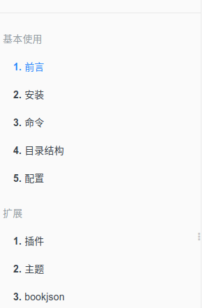
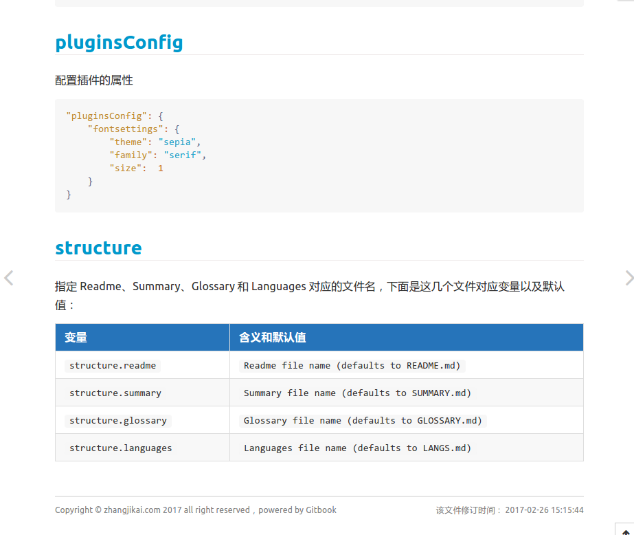
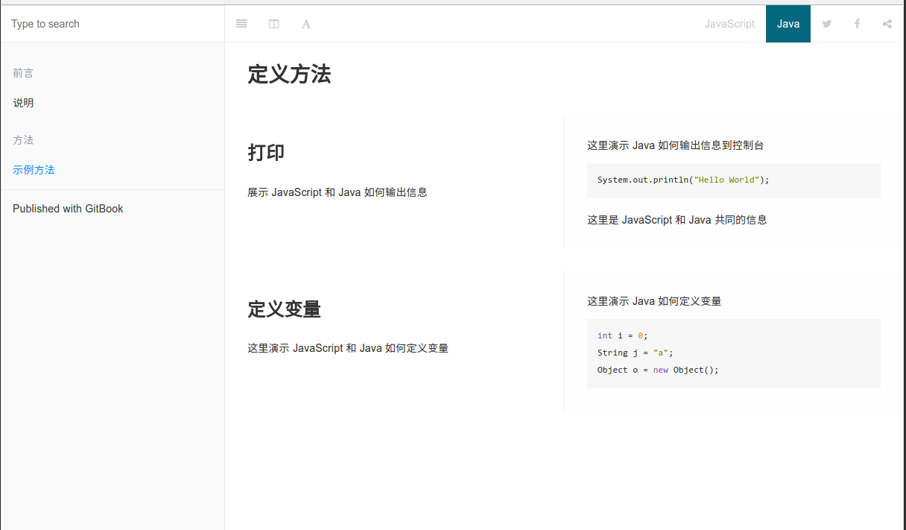
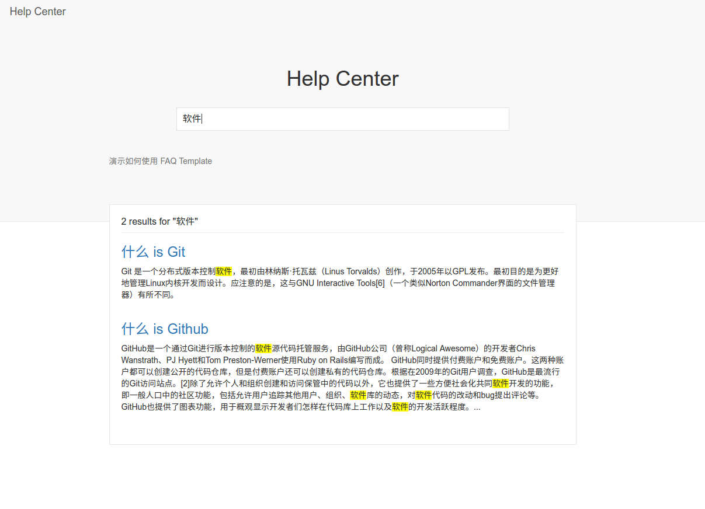

# 主题
目前 GitBook 提供了三类文档： Book 文档、API文档、FAQ文档。我们常用的就是 Book 文档模式，如果我们需要使用 API 文档模式或者 FAQ 文档模式，只需引入文档对应的主题插件即可，下面我们介绍与这三类文档相关的主题插件。
<!-- toc -->
## Book
Book 是我们常用的模式，大部分插件也都是针对这个模式做的。下面介绍一下针对 Book 模式的两个主题。
### theme-default
`theme-default` 是默认的 Book 主题。将 `showLevel` 设为 `true`， 就可以显示标题前面的数字索引，默认不显示。
```json
{
    "theme-default": {
        "showLevel": true
    }
}
```
在使用该主题的过程中，发现经常会在控制台报下面的错误，没有找到是哪里的原因，官方也一直没有修复。
```
theme.js:4 Uncaught TypeError: Cannot read property 'split' of undefined
```
后来在 [这里](https://github.com/maxkoryukov/theme-default/commit/811fcca17fcc84ad9ff3f940a4194dbffa62a31d) 看到一个解决方法，需要修改本地的 GitBook Theme 模板。下面是具体步骤：
* 进入 GitBook 默认主题所在的文件夹 `用户主目录` -> `.gitbook` -> `versions` -> `3.2.2` -> `node_modules` -> `gitbook-plugin-theme-default` -> `src` -> `js` -> `theme`，打开 `navigation.js`，找到 `getChapterHash` 函数
```js
function getChapterHash($chapter) {
    var $link = $chapter.children('a'),
        hash = $link.attr('href').split('#')[1];

    if (hash) hash = '#'+hash;
    return (!!hash)? hash : '';
}
```
* 将该函数修改为下面的形式:
```js
function getChapterHash($chapter) {
    var $link = $chapter.children('a'),
        hash,
        href,
        parts;

    if ($link.length) {
        href = $link.attr('href')
        if (href) {
            parts = href.split('#');
            if (parts.length>1) {
                hash = parts[1];
            }
        }
    }

    if (hash) hash = '#'+hash;
    return (!!hash)? hash : '';
}
```
* 回到 `gitbook-plugin-theme-default` 文件夹，运行 `npm install` 重新编译文件。

另外在 v3 版本中引入了 part 的概念 (通过标题或者水平分割线将 GitBook 分为几个 part)，所以目录的索引格式为 `part-index + article-index`。但是很多时候我们可能只有一个 part，并且不希望添加 part-index，即 `1.1`, `1.2` -> `1`, `2`。官方说是会在 v4 版本中解决这个问题，如果 v3 版本中希望去掉前面的 part-index，需要我们手动修改 gitbook 的源文件，下面是修改方法：
* 打开 `<user-home>/.gitbook/versions/3.x.x/lib/models/summaryPart.js`
* 修改第 51 行的内容：
    ```js
    // return SummaryArticle.create(article, [level, i + 1].join('.'));
    return SummaryArticle.create(article, (i + 1) + '');
    ```

这样修改之后会有个问题，即每个 part 都会从 1 开始计数，如下图所示：



对于这个问题，目前的解决方法就是使用不同版本的 GitBook，对 `3.2.2` 进行了修改， `3.2.3` 没有修改，当只有一个 part 的时候使用 `3.2.2` 的版本，多个 part 的时候使用 `3.2.3` 的版本。

### theme-comscore
为标题添加颜色，如下如所示



[插件地址](https://plugins.gitbook.com/plugin/theme-comscore)
```json
{
"plugins": [
        "theme-comscore"
    ]
}
```
##  API 文档
GitBook 同样可以编写 API 文档，只需要引入 [`theme-api` 插件](https://plugins.gitbook.com/plugin/theme-api)
```json
{
    "plugins": ["theme-api"],
    "pluginsConfig": {
        "theme-api": {
            "theme": "dark"
        }
    }
}
```
引入之后会替换默认的样式。下面是 API 文档的样式截图和在线演示：



[在线演示](http://gitbook.zhangjikai.com/api/) &nbsp;&nbsp; [示例源码](https://github.com/zhangjikai/gitbook-use/tree/v3-api)

使用 GitBook 的 API 文档模式时也可以使用插件，但是因为大部分插件可能针对写书的模式，所以有可能会出现不兼容的现象。

API文档的语法也很简单，因为主要是针对方法的，所以以方法为基本单位，通过下面的语法来定义一个方法
```


内容区


```
在内容区里面，通过 ` `来定义一个针对特定语言的演示，通过 `` 标识所有语言共同的部分。可以在 [这里](https://plugins.gitbook.com/plugin/theme-api) 查看完整的示例。

## FAQ 文档
[`theme-faq`](https://plugins.gitbook.com/plugin/theme-faq) 插件主要用来制作知识库或者帮助中心，GitBook 的 [帮助中心](https://plugins.gitbook.com/plugin/theme-faq) 就是使用的该主题。为了支持中文搜索我们需要引入 `search-pro` 包。
```json
{
    "plugins": [
        "theme-faq",
        "-lunr",
        "search-pro@^2.0.2"
    ]
}
```
下面是该主题的截图以及在线示例：



[在线演示](http://gitbook.zhangjikai.com/faq/) &nbsp;&nbsp; [示例源码](https://github.com/zhangjikai/gitbook-use/tree/v3-faq)

编写帮助中心很简单，在 `Summary` 里配置问题以及答案所在的文件，在对应文件中写入问题的答案即可，下面是一个示例  
`SUMMARY.md`
```
# Summary

* [什么 is Git](Git.md)
* [什么 is Github](Github.md)
```
`Git.md`
```
Git 是一个分布式版本控制软件，最初由林纳斯·托瓦兹（Linus Torvalds）创作，于2005年以GPL发布。最初目的是为更好地管理Linux内核开发而设计。应注意的是，这与GNU Interactive Tools[6]（一个类似Norton Commander界面的文件管理器）有所不同。
```
